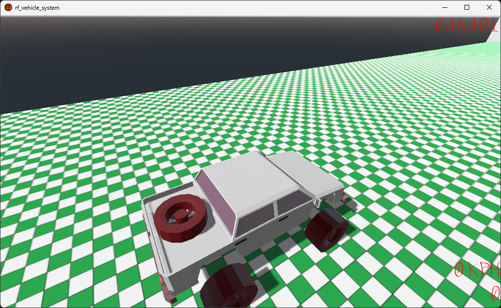

# rf_vehicle_system - Godot Engine Vehicle System

[README dengan Bahasa Indonesia Klik di Sini](https://github.com/rakifsul/rf_vehicle_system/blob/main/README_id.md)

## Intro

This project is an implementation of a vehicle system using Godot Engine.

## Where to Download

Download this project on the "Releases" page.

## How to Use

Open with Godot Engine 3, then run the scene.

## Screenshot

	

## Link untuk Traktir

- https://karyakarsa.com/rakifsul/info